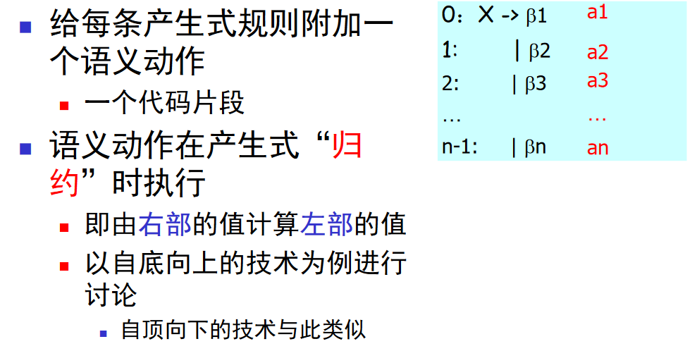
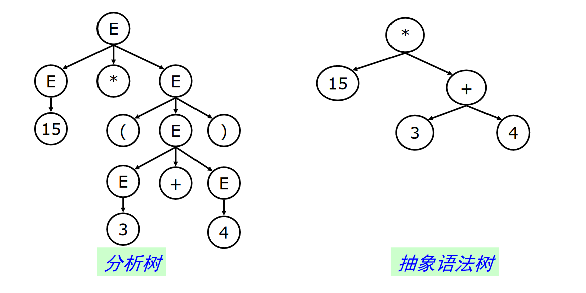
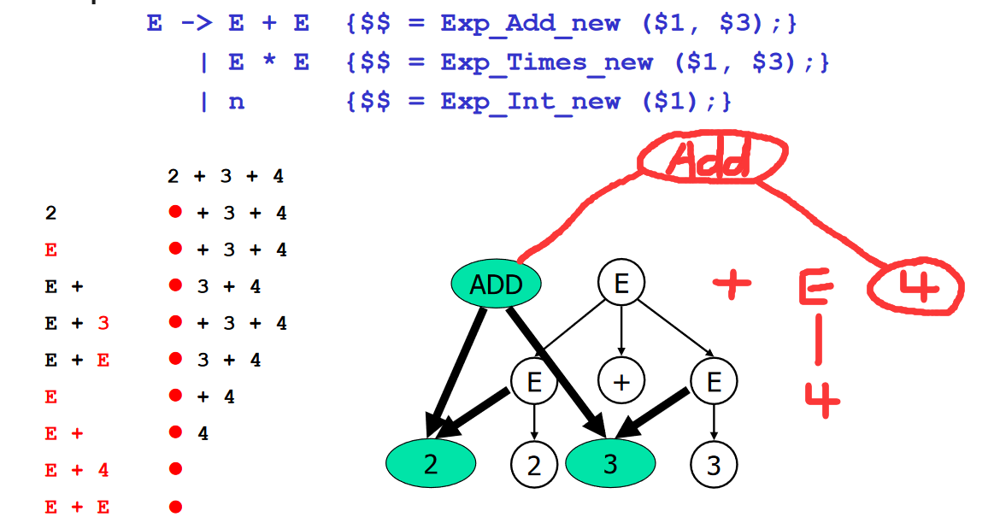

## 语法制导翻译(Syntax Directed Translation)的任务

目前为止，语法分析器只完成了回答Yes或No的功能，即检查语法是否合法，还必须完成后续的工作

* 类型检查
* 中间代码生成
* 目标代码生成
* ...

这些后续工作一般可通过**语法制导的翻译**完成


### LR分析中的语法制导翻译

在规约时执行语义动作，`{}`内就是语义动作


比如：计算表达式的值
$$
0:\ E\to E+E\ \{E=E_1+E_2\}\\
1:\ |\ n\ \{E=n\}
$$


```yacc
%{
//c声明
	#include<stdio.h>
	#include<stdlib.h>
	int yylex();
%}

%left '+' 	// 指定+号为左结合，取消二义性

%%

lines : line
	| line lines
;

line: exp '\n' {printf("value=%d\n",$1);}
;

exp: n	{$$=$1;}
	| exp '+' exp {$$=$1+$3;}
;

n: '1' 		{$$=1;}
	| '2' 	{$$=2;}
	| '3' 	{$$=3;}
	| '4' 	{$$=4;}
	| '5' 	{$$=5;}
	| '6' 	{$$=6;}
	| '7' 	{$$=7;}
	| '8' 	{$$=8;}
	| '9' 	{$$=9;}
	| '0' 	{$$=0;}
;

%%

int yylex()
{
	return getchar();
}
void yyerror(char *s)
{
	fprintf(stderr, "%s\n", s);
	return;
}
int main(int argc, char **argv)
{
	yyparse();
	return 0;
}
```

```bash
$ ./a.out
1+2
value=3
```

### 语法制导翻译的原理

**基本思想**



在分析栈上维护三元组: $<symbol, value, state>$


其中$symbol$是终结符或非终结符，$value$是$symbol$所拥有的值，$state$是当前分析栈的状态

## 抽象语法树

### 分析树与抽象语法树



分析树：

* 编码了句子的推导过程
* 但是包含很多不必要的信息，节点占用存储空间
* 需要知道那些信息是重要的
  * 对于表达式而言，只需要知道运算符和运算数
    * 优先级，结合性等已经在语法分析部分处理掉了
  * 对于语句，函数等其他构造而言也一样
    * 比如，编译器不关心复制符号是`=`还是`:=`


**具体语法和抽象语法**：

* **具体语法**是语法分析器使用的语法
  * 必须适合于语法分析，如各种分隔符，消除左递归，提取公因子等
* **抽象语法**是用来表达语法结构的内部表示
  * 现代编译器一般采用抽象语法作为前端（词法/语法分析器）和后端（代码生成）的接口


* 早期的编译器有的不采用抽象语法树数据结构
  * 直接在语法制导翻译中生成代码
* 现代编译器一般都采用抽象语法树作为语法分析器的输出
  * 更好的系统的支持
  * 简化编译器的设计


### 抽象语法树的自动生成

* 在语法动作中，加入生成语法树的代码片段
  * 片段一般是语法树的构造函数
* 在产生式规约的时候，会自底向上构造整棵数
  * 从叶子到根




* 抽象语法树是编译器前端和后端的接口
  * 程序一旦被转换成抽象语法树，则源代码即被丢弃
  * 后续阶段只处理抽象语法树
* 所以抽象语法树必须编码足够多的源代码信息
  * 例如，语法结构所在位置（文件、行号、列号等）


