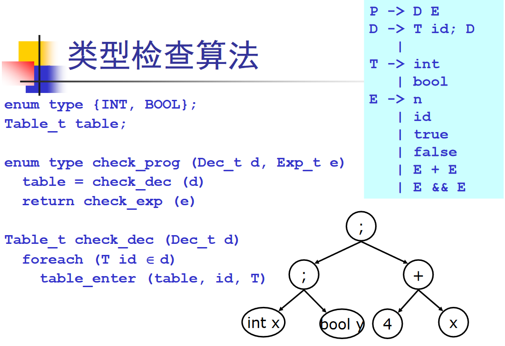
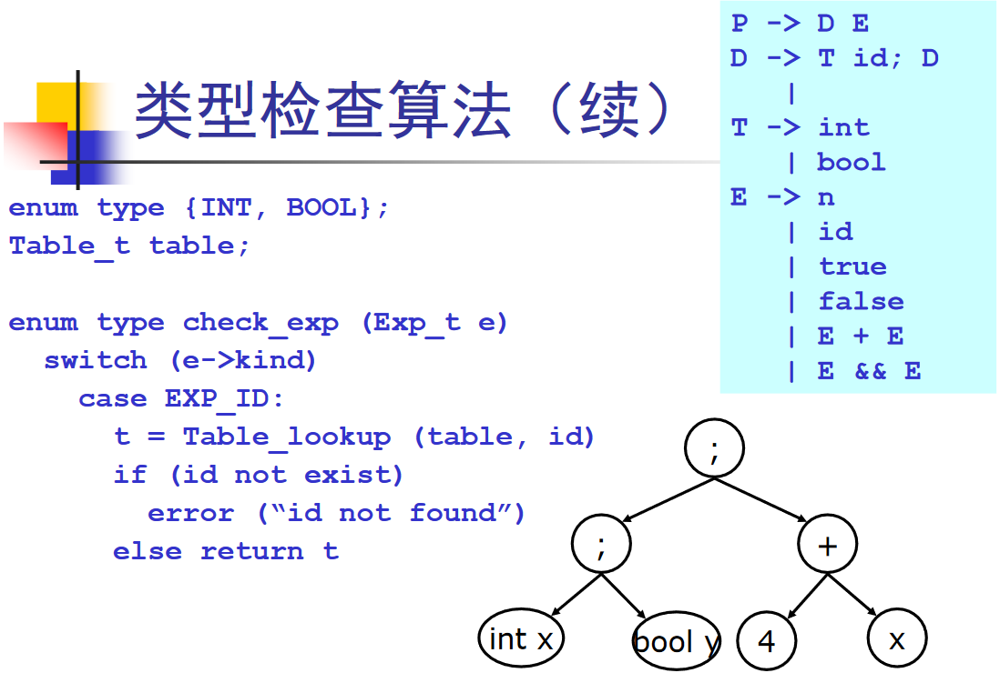

## 语义分析(Semantic Analysis)的任务

编译器前端：


语义分析的任务就是输出图中的中间表示。早期编译器语义分析往往直接生成目标代码，现代编译器需要对代码做优化或其他分析，所以生成中间表示（中间代码）。


* **语义分析**也称为**类型检查(Type Checking)**、**上下文相关分析**
* 负责**检查**程序（抽象语法树）的上下文相关的属性，这是具体语言相关的，如：
  * 变量在使用前先进行声明
  * 每个表达式都有合适的类型
  * 函数调用和函数的定义一致
  * ...


```c
void f(int *p)
{
    x += 4; // ?
    p(123); // ?
    "hello" + "world"; // ?
}
int main()
{
    f() + 5; // ?
    break; // ?
    return; // ?
}
```


上面的C程序，对语法分析器来说是合法的，但是它明显有许多错误，找出这些错误是语义分析的任务。


**程序的语义：**

* 传统上，大部分程序设计语言的语义都采用自然语言来表达程序语言的语义
* 编译器的实现者必须对语言中的语义规定有全面的理解


## 语义规则及实现

### 类型检查

定义一个c--语言：


$$
E\to n\\
\ |\ true\\
\ |\ false\\
\ |\ E+E\\
\ |\ E\ \&\&\ E
$$

```c
// 类型合法的程序：
3+4
false && true
// 类型不合法的程序
3 + true
true + false
// 注意在文法上,他们都是合法的
// 语义分析的任务是，对于一个给定的表达式e而言，写一个函数
type check(e);
// 返回表达式e的类型，不合法则报错
```


### 变量声明的处理

扩充语言，必须有声明和表达式。
$$
P\to D\ E\\
\ \\
D\to T\ id;\ D\ |\ \varepsilon\\
\ \\
T\to int\\
\ |\ bool\\
\ \\
E\to n\\
\ |\ true\\
\ |\ false\\
\ |\ E+E\\
\ |\ E\ \&\&\ E
$$

```c
// 合法
int x;
x+4
// 不合法
bool y;
false && y
// 不合法
x + 3
// 不合法
int x;
x + false
```

检查算法： table是符号表





### 语句的处理


### 符号表

* 用来存储程序中的变量相关信息
  * 类型
  * 作用域
  * 访问控制信息
* 必须非常高效，因为程序中变量规模会很大


符号表是典型的字典结构：`symbolTable: key -> value`

| 变量/映射 | type | scope | ...  |
| --------- | ---- | ----- | ---- |
| x         | INT  | 0     | ...  |
| y         | BOOL | 1     | ...  |


* 为了高效，可以使用hash表(O(1))，或者红黑树(O(logN)更小)

* 处理作用域的方法
  * 一张表
    * 进入作用域时，插入元素
    * 离开作用域时，删除元素
  * 采用符号表构成的栈
  * 进入作用域时，插入新的符号表
  * 离开作用域时，删除栈顶符号表

* 名称空间
  * 每个名字空间用一个表来表示


## 其他问题

* 类型相容性
* 错误诊断
* 代码翻译
  * 现代编译器的语义分析模块，除了做语义分析外，还要负责生成中间代码或目标代码
  * 因此语义分析模块往往是编译器中最庞大复杂的模块


