## 代码生成(Code Generation)的任务

中端和后端：

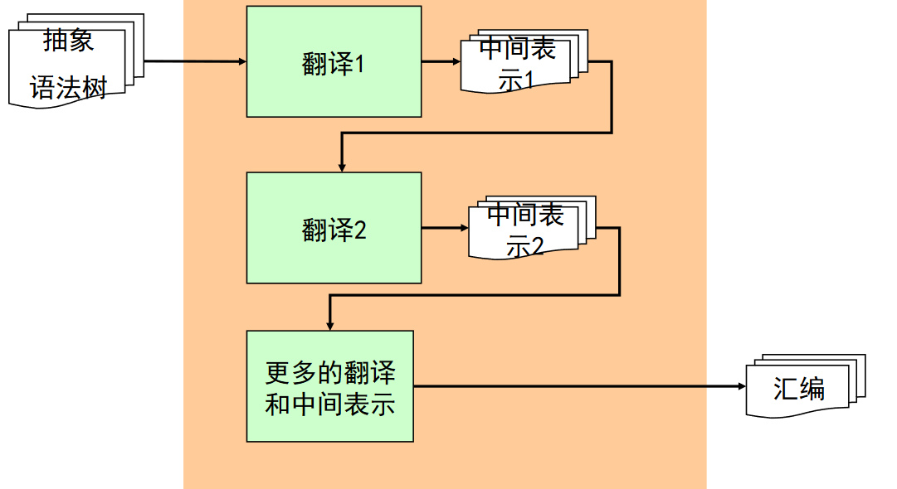

最简单的结构：

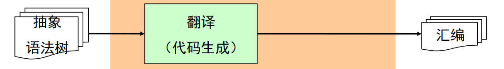


简单的结构在早期非常流行，现代编译器很少用，而是分成多个阶段向目标代码靠近。


代码生成的任务：

* 负责把源程序翻译成“目标机器”上的代码
  * 目标机器可以是真是物理机
  * 可以实虚拟机，jvm...
* 两个重要的子任务
  * 给源程序的数据分配计算资源
    * 数据
      * 全局变量、局部变量、动态分配
      * 还要考虑变量放在内存还是寄存器之类的问题
    * 计算机资源
      * 寄存器、数据区、代码区、栈区、堆区
  * 给源程序的代码选择指令
    * 源程序的代码
      * 表达式运算、语句、函数等
    * 机器指令
      * 算数运算、比较、跳转、函数调用返回
      * 需要熟悉指令集体系结构(ISA)


下面研究两种不同的ISA上的代码生成技术

* 栈计算机Stack
* 寄存器计算机Reg


## 栈式计算机


* 效率低，基本已经退出历史舞台，现在没有物理机用这个结构
* 栈式计算机生成代码是**最容易**的
* 仍然有许多栈式虚拟机
  * Pascal P code
  * java virtual machine (JVM)
  * Postscript
  * ...


一个简单的栈式计算机：

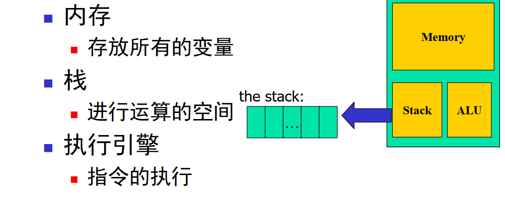


指令集：
$$
s\to\ push\ NUM\\
|\ load\ x\\
|\ store\ x\\
|\ add\\
|\ sub\\
|\ times\\
|\ div
$$


```
push NUM	压入立即数	stack[++top]=NUM;

load x		从内存读入到栈顶	stack[++top]=x;
store x		弹出栈顶变量，并赋值给内存	x=stack[top--];

add			+ 	temp=stack[top-1]+stack[top]; top-=2; push temp;
sub			-
times		*
div			/

变量内存分配的伪指令(只支持整形)
.int x		为变量x分配内存单元


示例
int x;
int y;
int z;

x = 10;
y = 5;
z = x + y;
y = z * x;
指令
.int x
.int y
.int z

push	10
store	x
push	5
store	y
push	x
push	y
add
store	z
load	z
load	x
times
store	y
```


### 递归下降代码生成算法

从c--到stack


会发现这是对抽象语法树的后序遍历，和语义分析差不多，所以很多编译器把语义分析和代码生成（或中间代码生成）和二为一


不变式：表达式的值总在栈顶

```
Gen_E(E e)
	switch (e)
		calse n: emit("push n"); break;
		calse id: emit("load id"); break;
		case true: emit("push 1"); break;
		case false: emit("push 0"); break;
		case e1+e2: Gen_E (e1);
					Gen_E (e2);
					emit("add"); break
		case ...: ... // ...
```

不变式：执行后，栈的规模不变

```
Gen_S(S s)
	switch (s)
		case id=e:  Gen_E(e);
					emit("store id"); break;
		case printi(e): Gen_E(e);
						emit("printi"); break;
		case printb(e): Gen_(e);
						emit("printb"); break;
```

不变式：只生产.int类型

```
Gen_T(T t)
	switch (t)
		case int: emit(".int"); break;
		case bool: emit(".int"); break;
		
Gen_D (T id; D)
	Gen_T(T);
	emit("id");
	Gen_D(D);
	
Gen_P(D S)
	Gen_D(D);
	Gen_S(S);
```


## 寄存器计算机

* 寄存器计算机是目前最流行的机器体系结构之一

  * 效率很高
  * 机器体系结构很工整

* 机器基于寄存器架构

  * 典型的有16、32或更多寄存器，所有操作都在寄存器中进行
  * 访存都通过 load/store 进行，内存不能直接运算

  

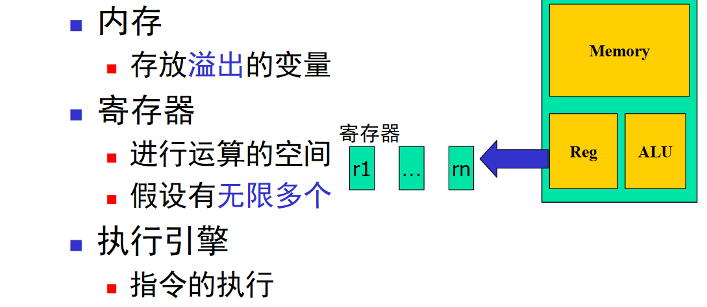

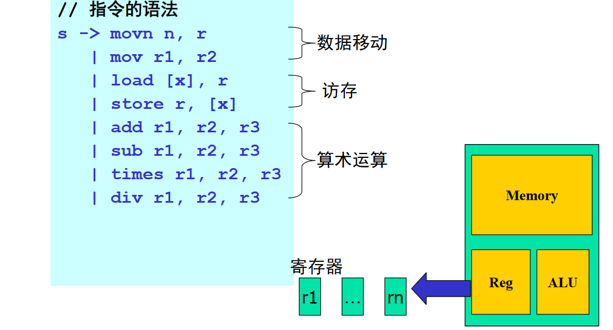

```
movn n, r		把n放入寄存器r
mov  r1, r2 	把r1赋值r2
load [x], r 	把内存的值读入寄存器r
store r, [x]	把r的值存入内存
add r1, r2, r3 	r3=r1+r2
sub r1, r2, r3
times r1, r2, r3
dive r1, r2, r3

为变量分配寄存器的伪指令
.int x
```

因为假设有无限多个寄存器(真实机器不可能)

* 因此每个声明变量和临时变量都会占用一个（虚拟）寄存器
* 把虚拟寄存器分配到物理寄存器的过程称为**寄存器分配**

### 递归下降代码生成算法

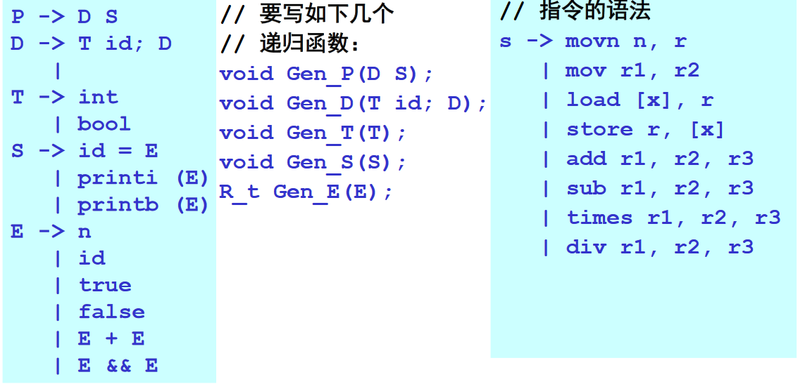

略


## 中间代码(Intermediate Code Generation)的地位和作用

中间代码/中间表示:

* 树和有向无环图（DAG）
  * 高层表示，适用于程序源代码。抽象语法树就是个树
* 三地址码（3-address code）
  * 低层表示，靠近目标机器
* 控制流图（CFG）
  * 更精细的三地址码，程序的图状表示
  * 适合做程序分析、程序优化等
* 静态单赋值形式（SSA）
  * 更精细的控制流图
  * 同时编码控制流信息和数据流信息
  * gcc4.0之后用了这个
* 连续传递风格（CPS）
  * 更一般的SSA
  * SSA一般是函数内，CPS可以表示跨函数或跨模块
* ... 等等


为什么要划分成这么多中间表示？

* 编译器工程上的考虑

  * 阶段划分：把整个编译过程划分成不同的阶段
  * 任务分解
  * 代码工程：代码更容易实现、维护、演进

* **程序分析**和**代码优化**的需要

  * 许多优化在特定的中间表示上才可以或才容易进行

* 更通用

  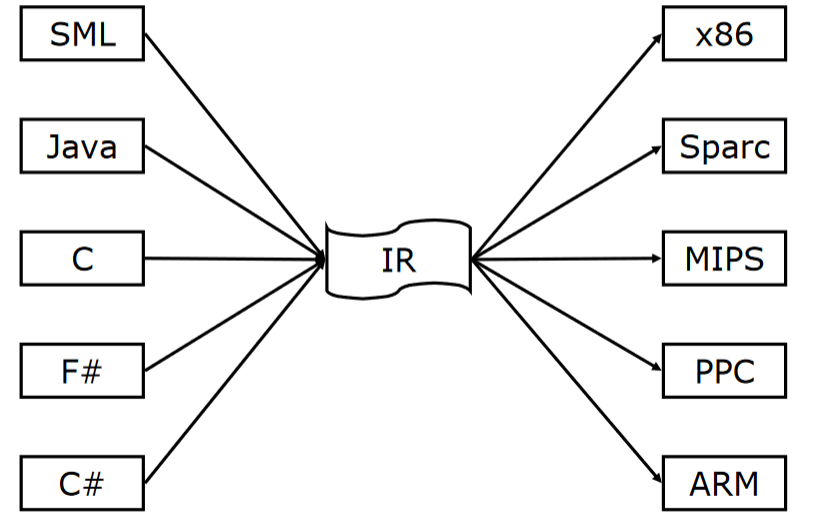

## 三地址码

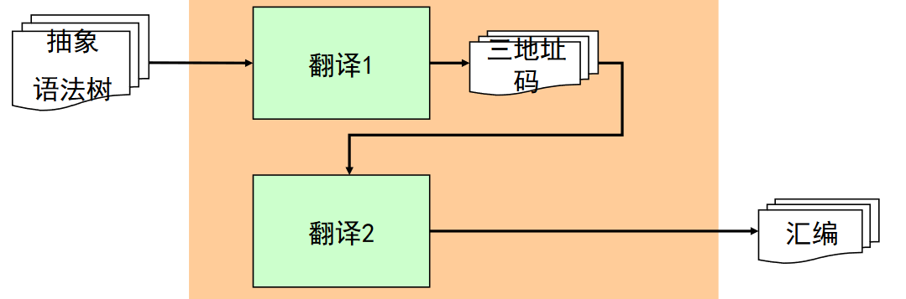


三地址码基本思想

* 给每个中间变量和计算结果命名
  * 没有复合表达式
* 只有最基本的控制流
  * 没有各种控制结构
  * 只有goto, call等
* 所以三地址码可以看成是抽象的指令集
  * 通用的RISC


示例

```
a = 3 + 4 * 5;
if(x < y)
	z = 6;
else
	z = 7;
	
/*****************************/

x_1 = 4;
x_2 = 5;
x_3 = x_1 * x_2;
x_4 = 3;
x_5 = x_4 + x_3;
a = x_5;
Cjmp (x<y, L_1, L_2);
L_1:
	z = 6;
	jmp L_3;
L_2:
	z = 7;
	jmp L_3;
L_3:
	...
```


一个简单的三地址码定义

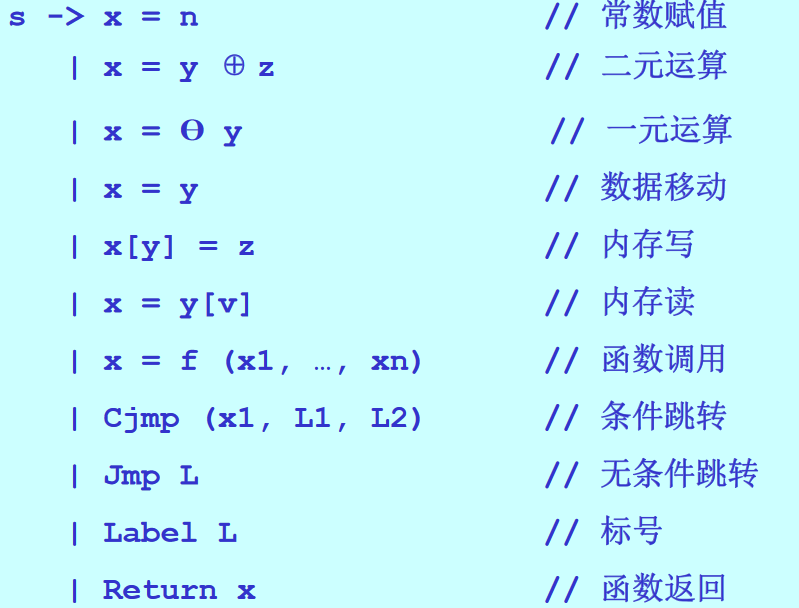

## 控制流图

好处：

* 控制流分析
  * 典型问题，”程序中是否存在循环？“
* 数据流分析
  * “某个变量的值可能是什么”


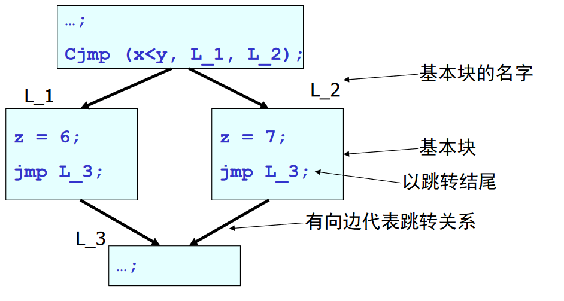


* 基本块：是语句的一个序列，从第一条执行到最后一条
  * 不能从中间进入
  * 不能从中间退出
    * 即跳转指令只能出现在最后
* 控制流图：有向图$G=(V,E)$
  * 节点：基本块
  * 边：基本块之间的跳转关系


如何生成控制流图：

* 直接从抽象语法树生成
  * 如果高层语言的控制流结构比较工整的话，比较容易
* 先生成三地址码，然后继续生成控制流图
  * 像包含`goto`语句的语言，更合适
  * 更通用，阶段划分


控制流图应用之一：死基本块删除

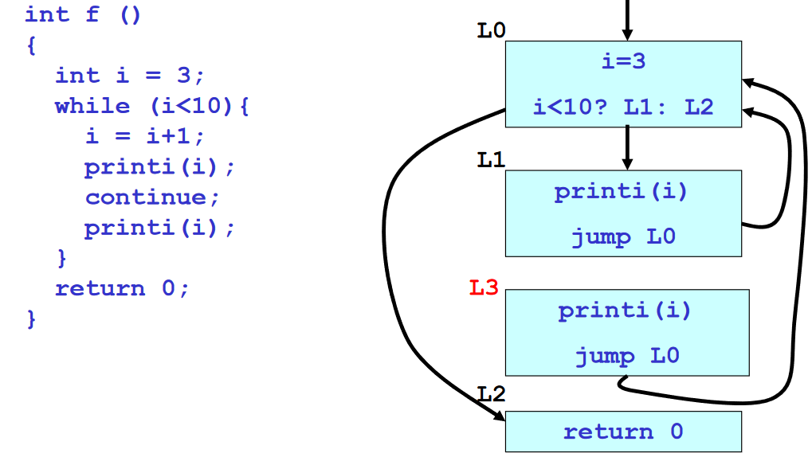

## 数据流分析

优化的一般模式：

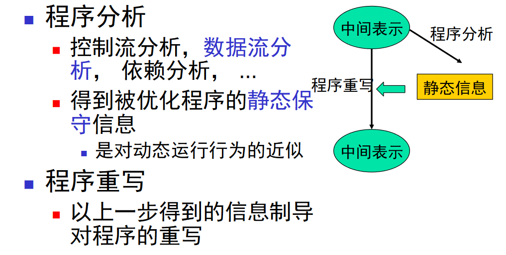

两种具体的数据流分析：

* 到达定义分析
* 活性分析


